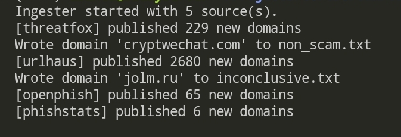

# Brand Sentinel 🛡️

Proactive detection of scam, fraudulent, and impersonation websites to protect your brand's digital presence.



## Credits  

This project was inspired by the invaluable guidance I received during my internship, where I had the privilege of learning from the Asia-Pacific Digital Risk Protection team at a leading Russia-founded cybersecurity company. Their passion for defending against cybercrime and their patience in mentoring me broadened my perspective on Digital Risk Protection and directly inspired this work. I dedicate this project to them in gratitude. 

## Problem: The Rising Tide of Digital Threats

In the digital age, a company's brand is one of its most valuable assets. However, this asset is under constant assault. Malicious actors are no longer just sending fear-mongering emails; they are deploying sophisticated social engineering campaigns using fraudulent websites that perfectly impersonate trusted brands.

These attacks have a devastating impact:
 * Financial Loss: Direct theft from customers and the company.
 * Reputational Damage: Erosion of customer trust that can take years to rebuild.
 * Data Breaches: Loss of sensitive customer and corporate data.

Traditional defenses like simple blocklists are reactive and insufficient. Scammers can register and weaponize new domains in minutes, staying one step ahead. This is a critical challenge for businesses of all sizes—from startups operating on thin margins to large corporations whose brand equity is paramount.

Digital Risk Protection (DRP) is the practice of safeguarding these digital assets. Brand Sentinel is a tool built on DRP principles to provide a proactive defense against web-based brand impersonation.

## Guiding Question

> Can we create a free, open-source data pipeline that provides accurate, real-time intelligence on scam domains impersonating a brand, empowering businesses to defend their online presence?

With the intelligence gathered by Brand Sentinel, your security team can:
 * Gain immediate visibility into active scam campaigns targeting your company.
 * Triage threats effectively and prioritize takedown actions.
 * Build a case to engage cybersecurity vendors for domain takedown services with concrete evidence.

## ✨ Key Features
 * Real-time Monitoring: Ingests data from multiple high-quality threat intelligence feeds.
 * Heuristic-Based Analysis: Uses a sophisticated ensemble of checks to identify malicious domains with high accuracy, minimizing false positives.
 * Extensible Architecture: Built on an event-driven model that is easy to extend with new data sources or custom detection logic.
 * Cost-Effective: Leverages free and open-source intelligence feeds to provide powerful protection without expensive subscriptions.
 * Actionable Output: Classifies domains into clear categories (Scam, Benign, Inconclusive) so you know exactly where to focus your efforts.


## ⚙️ How It Works
Brand Sentinel operates on a three-stage pipeline: Ingestion, Detection, and Triage.
### 1. Data Ingestion: The Sourcing Pipeline
To provide robust and timely intelligence, we aggregate data from a variety of trusted, open-source threat feeds. This multi-source approach ensures broader coverage of newly emerging threats. The choice of free and open-source feeds makes this tool accessible to everyone.
Our core ingestion sources include:
 * crt.sh: Monitors certificate transparency logs to find newly issued SSL certificates for domains that might be typosquatting your brand (e.g., go0gle.com instead of google.com). This is often the earliest signal of a planned attack.
 * URLhaus: A project from abuse.ch that collects and shares URLs distributing malware.
 * OpenPhish: A community feed that provides active phishing URLs.
 * PhishStats: A real-time phishing data provider with a publicly accessible API.
 * ThreatFox: Another project by abuse.ch focused on sharing indicators of compromise (IOCs) associated with malware.
Brand Sentinel is also designed to be easily extended with commercial, subscription-based data sources like URLScan.io or OTX for organizations requiring even deeper intelligence.
### 2. Detection Engine: The Heuristic Model
A single indicator is rarely enough to condemn a domain. Instead of relying on simple signatures, Brand Sentinel uses an ensemble of heuristics, where each heuristic acts as a weighted signal. Some signals are conclusive (e.g., a HTTP 404 status), while others are contributing (e.g., a newly registered SSL certificate). The cumulative score determines the final classification.
Our key heuristics include:
| Heuristic | Description |
|---|---|
| Inactive Domain | Checks if the domain is unresponsive or returns a non-200 HTTP status (e.g., 404, 503). Inactive domains are often parked or have been taken down. |
| Parking Domain | Identifies if the domain resolves to a known domain parking service. These are typically benign but can be weaponized later. |
| Brand Lookalike | Detects domains using typosquatting, combosquatting, or other visual similarities to impersonate a legitimate brand. |
| Forbidden Token | Scans the page content for suspicious keywords often associated with scams (e.g., "limited offer," "account suspended," "verify now"). |
| Forms Exfil | Detects login forms or input fields that submit data to a different, potentially malicious domain. |
| Redirect/Cloaking | Identifies domains that use suspicious redirects or cloaking techniques to hide their true nature from automated scanners. |
| Phishing Kit | Checks for known signatures or file structures associated with popular, off-the-shelf phishing kits. |
| DNS/Email Posture | Analyzes DNS records (MX, SPF, DMARC) to assess if the domain is configured to send legitimate email, a common trait of legitimate domains. |
| TLS Certificate | Examines the SSL/TLS certificate. A short lifespan or issuance from a less-reputable CA can be a red flag. |
| Long Lived Certificate | A supplementary check to reward domains with a long-standing, trusted certificate history. |

### 3. Triage & Output: Actionable Intelligence
Domains are classified into one of three categories to guide your security team's response:
 * 🚨 Scam: High Priority. These domains have either been positively identified as malicious by a high-confidence heuristic or have accumulated a high-risk score across multiple checks. Your team should investigate these immediately for takedown.
 * 🤔 Inconclusive: Requires Manual Review. These domains exhibit suspicious characteristics but lack definitive proof of malice. They warrant a closer look by an analyst after all high-priority alerts have been addressed.
 * ✅ Benign: Low Priority. These domains have passed all checks or have been identified as legitimate (e.g., a known parking page). They can be safely ignored for now, though Brand Sentinel will continue to monitor them for any future changes.

## 🏗️ System Architecture
Brand Sentinel is built on an asynchronous, event-driven architecture. This design choice provides two key advantages:
 * Scalability & Performance: Each stage of the pipeline (ingestion, analysis, output) can operate independently, allowing for real-time processing of large volumes of data without bottlenecks.
 * Extensibility: Adding a new data source or a custom detection heuristic is as simple as creating a new, self-contained module that subscribes to the event stream. This makes it incredibly easy for your team to customize the tool with proprietary intelligence.


## 🚀 Getting Started: Local Demo
You can run a local instance of Brand Sentinel to monitor your own brand.
Prerequisites
 * Docker (for running Redis). Follow 
 * Python 3.9+

### Installation & Setup
0. Install Docker and Redis. Follow the [official Redis' guide](https://redis.io/docs/latest/operate/oss_and_stack/install/install-stack/docker/).
```bash
docker-compose up
```

1.  Clone the repository:

```bash
git clone https://github.com/your-username/brand-sentinel.git
cd brand-sentinel
```

2. Start Redis using Docker:
   Redis will act as our message broker for the event-driven system.
```bash   
docker run --name brand-sentinel-redis -p 6379:6379 -d redis
```

3. Create and activate a virtual environment:
```bash   
python -m venv .venv
source .venv/bin/activate
```
> On Windows, use: .venv\Scripts\activate

4. Install dependencies:
```bash   
pip install -r requirements.txt
```

5. Configure your brands:
   Open config.yaml and add the brands you want to monitor under the 'brands' field. Use variations without TLDs.

### Running the Tool
6. Start the polling process:
   The tool will begin ingesting data and analyzing domains.
```bash   
python main.py
```
   Polling will continue until you stop the process with Ctrl+C.

7. Check the output:
   The results will be continuously written to the following files in the project's root directory:
   * scam.txt
   * inconclusive.txt
   * benign.txt

## 🤝 Contributing
We welcome contributions from the community! Whether it's adding a new data source, improving a heuristic, or fixing a bug, your help is appreciated. Please feel free to open an issue or submit a pull request.

## Credits & Contact
Hi, I'm Choonyong Chan! I'm passionate about building tools that make the digital world a safer place.

Feel free to reach out on [LinkedIn](https://www.linkedin.com/in/chanchoonyong/) for collaborations or questions.
